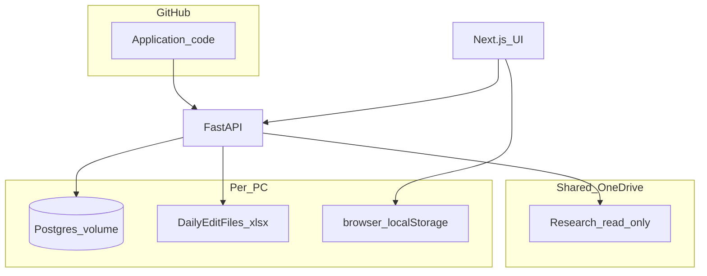

# As-Is Architecture (Phase 0 Audit)

Repository: `pms-decision-platform`  
Stack: FastAPI + SQLAlchemy + Alembic + Postgres 17 + Next.js 15 (App Router)  
Local runtime: Docker Compose (`postgres`, `api`, `ui`)

## Users and machines

| User | Role (app) | Typical machine | Production role today |
|------|------------|-----------------|---------------------|
| Samir | `admin` | Mac (developer) | Local Docker + OneDrive Research |
| Julesh | `client` | Windows laptop | Local Docker + OneDrive Research |
| Yash | (not seeded in app) | USA Mac | Ships code via GitHub; no separate app role yet |

Each machine runs an **independent** Docker stack with its **own** `postgres_data` volume. Code is synchronized via GitHub; **operational data is not**.

## Storage layers (four tiers)

### 1. Postgres (per PC — authoritative for app features)

**35 tables** across episodes, transactions, bhav, watchlists, fundamentals, users.

Key operational tables:

| Domain | Tables |
|--------|--------|
| Bhav | `bhav_import_runs`, `nse_bhav_bars`, `pivot_vol_exp` |
| Pivot | `pivot_portfolio_symbols` (`sort_order`, metadata) |
| Episodes / analytics | `securities`, `transactions`, `investment_episodes`, `decision_events`, `portfolio_snapshots`, `daily_prices`, … |
| Watchlists | `watchlists`, `watchlist_members`, `watchlist_alerts`, `watchlist_member_metrics`, … |
| Auth | `users` |

Alembic head: `w9x0y1z2a3b4` (31 migrations).

### 2. Research (OneDrive — read-only to app)

- Path: sibling `Research/` under OneDrive Personal (e.g. `…/OneDrive-Personal/Research`)
- Mounted read-only at `/data/research` when `RESEARCH_DIR` set
- Contains transaction masters, `Portfolio/History`, snapshots, benchmarks
- App must **never write** here
- Used by Refresh pipeline, holdings history valuation, snapshot import

### 3. DailyEditFiles (per PC — writable Excel, **not git-synced**)

- Default host path: `../DailyEditFiles` relative to repo
- Mounted writable at `/data/daily_edit`
- Workbooks resolved by **newest filename** matching keywords:
  - `pms` + `client` → Client Portfolio
  - `chart` → Charts
  - `pivot` → Pivot seed
  - `sca` / `llp` + `stock` → SCA LLP
- Seeded once from Research on Refresh if missing (does not overwrite existing)

### 4. Browser localStorage (per browser — non-authoritative)

| Key | Component | Business impact |
|-----|-----------|-----------------|
| `pivot-selected-firms` | Pivot UI | Selection order backup; DB also stores watchlist |
| `charts-corr-pcts` | Charts UI | Corr A/B slider % |
| `pms-bse-smallcap-edits` | Client Portfolio | SmallCap year edits pending save |
| `watchlist-screener-view-v1` | Watchlist screener | UI layout only |

Also: `sessionStorage` `pivot-preselect-symbols` (navigation hint).

## Docker Compose bind mounts

| Host env | Container | RW | Purpose |
|----------|-----------|-----|---------|
| `RESEARCH_DIR` | `/data/research` | RO | Research tree |
| `DAILY_EDIT_DIR` | `/data/daily_edit` | RW | Operational Excel |
| `FINAL_MASTER_DIR` | `/data/final_master` | RO | Security/txn master seed |
| `ONEDRIVE_EXTERNAL_DATA_DIR` | `/data/external` | RO | Market data CSVs |
| `./docker/market_data_seed` | `/data/external_seed` | RO | Fallback prices |
| `./docker/portfolio_snapshot_seed` | `/data/snapshot_seed` | RO | Snapshot fallback |
| Named volumes | `/data/raw`, `processed`, `exports`, `uploads` | RW | Ingestion staging |

API entrypoint: `alembic upgrade head` + `ensure_builtin_users` on every container start.

UI proxies `/backend/*` → `api:8000` for same-site cookies.

## Data paths by feature

### Client Portfolio

- **Read:** `DailyEditFiles/PMS_ClientPortfolio*.xlsx` → Model + Stocks sheets; fallback Research copy
- **Parse:** `client_portfolio_parse.py` — qty/index/date from Model; `mcap_factor` from formula
- **Price/Value/Percent/Total:** `client_portfolio_dashboard.py` joins `nse_bhav_bars` for as-of close
- **Mcap / %Firm:** `mcap_factor × bhav_close`; `%Firm` from Stocks qty (computed, not Excel cache)
- **Writes:** `write_bse_smallcap_year`, `write_sca_bank_balance` (SCA book only for bank)

### Charts

- **Read:** `Charts*.xlsx` Range sheet + bhav from Postgres
- **Writes:** `write_charts_range_hlc`, `write_charts_range_weekly` → Excel cols B/C/M/S/T/U
- **Bhav sheet:** `apply_bhav_csv_to_daily_edit_files` on commit

### Pivot

- **Read:** Postgres `nse_bhav_bars`, `pivot_portfolio_symbols`, open episodes ∪ Client Model symbols
- **Writes:** `upsert_portfolio_symbols`, `delete_portfolio_symbol`; bhav upload validate/commit
- **Hidden:** `LIQUIDCASE` filtered in `pivot_dashboard.py`

### SCA LLP

- **Read/Write:** `SCA_LLP*.xlsx` Quantity sheet; bhav commit revalues qty/stocks sheets

### Holdings / Episodes / Refresh

- **Refresh:** `onedrive_refresh.py` — Research → raw → reimport transactions/episodes/snapshots → market data → analysis
- **Holdings:** Postgres episodes + bhav + Research history books

## Excel write paths (production code)

| Module | Function | Target |
|--------|----------|--------|
| `client_portfolio_parse.py` | `write_bse_smallcap_year`, `_replace_save` | PMS_ClientPortfolio |
| `charts_dashboard.py` | `write_charts_range_hlc`, `write_charts_range_weekly` | Charts |
| `daily_edit_bhav.py` | `apply_bhav_csv_to_daily_edit_files`, `write_sca_bank_balance` | Charts + SCA |
| `masters/apply.py` | `apply_edits` | Final master workbooks |
| `analytics/exports.py` | `export_sell_since_workbook` | Export path |

## API mutation surface (summary)

~35 mutation endpoints across auth, imports, masters, pivot/bhav, client-portfolio patches, charts patches, watchlists, market-data refresh. Full inventory in Phase 0 agent audit — see `src/pms_platform/api/main.py` router includes.

## Authentication (current)

- HTTP-only cookie `pms_session`
- Invite-only users in `users` table
- Roles: `admin`, `member`, `client` (string on user row — **not** normalized permissions yet)
- `AUTH_DISABLED=1` bypasses auth for local dev
- Seeded users via `ensure_builtin_users` on API startup (see credential scan)

## Known divergence causes (why PCs differ)

1. Separate Postgres volumes (bhav days, pivot symbols, watchlists, episodes)
2. Separate DailyEditFiles copies (formula caches, Stocks prices)
3. Different `RESEARCH_DIR` hydration (OneDrive cloud-only placeholders)
4. localStorage not shared
5. Different as-of bhav day selected in UI

## Tests

- **274** test functions in `tests/` (66 modules)
- **3 pre-existing failures** documented in `IMPLEMENTATION_STATUS.md`
- No Playwright E2E in repo yet

## Planned target (summary)

Single Supabase Postgres (Mumbai) + Railway UI/API/worker + approval workflow + no live Excel. See `TARGET_ARCHITECTURE.md`.
