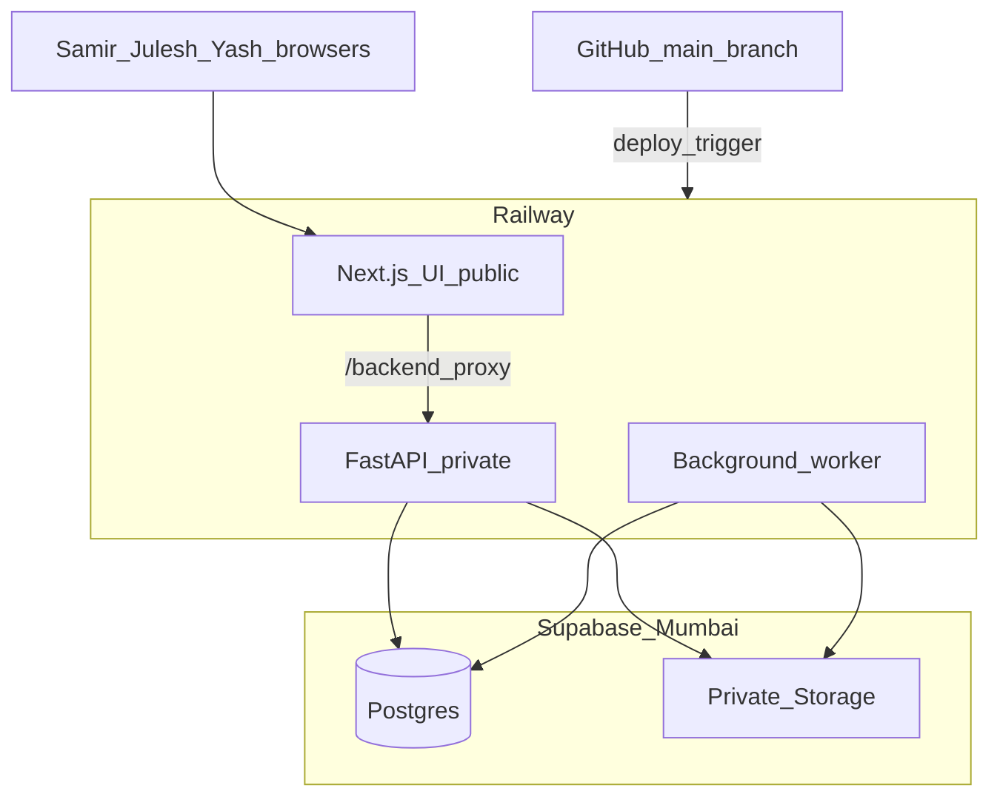

# Target Architecture

## Production topology

## Data flow (post cutover)

1. **Official data** — approved rows in Postgres only.
2. **Draft/submitted** — `change_requests` + `change_operations`; never in official calculators.
3. **Files** — immutable versions in storage; metadata + checksum in Postgres.
4. **Derived metrics** — computed from approved inputs + approved bhav; cached with revision keys.
5. **Research** — optional migration intake / archive; not runtime mount in production.

## Read contexts

| Mode | Who | Data |
|------|-----|------|
| `official` | Everyone (default reports) | Approved canonical rows |
| `mine` | Contributor | Approved + own draft/submitted overlay |
| `proposal` | Samir (reviewer) | Approved + one submitted request overlay |

Implemented in: `src/pms_platform/read_context.py`

## Feature flags (local dev defaults)

| Flag | Default | When true |
|------|---------|-----------|
| `FEATURE_LEGACY_EXCEL_READ` | on | Read DailyEdit/Research workbooks |
| `FEATURE_LEGACY_EXCEL_WRITE` | on | openpyxl saves to DailyEdit |
| `FEATURE_APPROVAL_WORKFLOW` | off | Route mutations through change requests |
| `FEATURE_CLOUD_STORAGE` | off | Use Supabase storage adapter |

## Approval engine

- Tables: `change_requests`, `change_operations`, `audit_events`, `user_permissions`, `jobs`, `outbox_events`
- Service: `src/pms_platform/approval/service.py`
- Handlers: `src/pms_platform/approval/handlers/registry.py` (typed, no dynamic SQL)

## Environment variables (production placeholders)

See `.env.example` and `DEPLOYMENT_RUNBOOK.md` (Phase 7).

- `DATABASE_URL` — pooler (runtime API/worker)
- `DATABASE_DIRECT_URL` — direct (migrations only)
- `SESSION_SECRET` / `AUTH_SECRET`
- `PUBLIC_APP_URL`, `INTERNAL_API_URL`
- `SUPABASE_URL`, `SUPABASE_SERVICE_ROLE_KEY` (backend only)
- Storage bucket names
- Feature flags for cutover

## Local development

Docker Compose unchanged: postgres + api + ui on each machine for dev/test. Production uses hosted services only.
